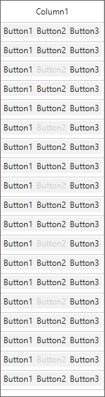

# How to enable/disable specific button in the CellButtons collection of GridButtonColumn in WinForms DataGrid (SfDataGrid) conditionally?

## About the sample

This sample illustrates how to enable/disable specific button in the CellButtons collection of GridButtonColumn in WinForms DataGrid.

[WinForms DataGrid](https://www.syncfusion.com/winforms-ui-controls/datagrid) (SfDataGrid) allows you to enable/disable specific buttons in a [GridButtonColumn](https://help.syncfusion.com/cr/windowsforms/Syncfusion.WinForms.DataGrid.GridButtonColumn.html) cells conditionally when multiple buttons are added to each cells. This can be achieved by using [SfDataGrid.QueryButtonCellStyle](https://help.syncfusion.com/cr/windowsforms/Syncfusion.WinForms.DataGrid.SfDataGrid.html#Syncfusion_WinForms_DataGrid_SfDataGrid_QueryButtonCellStyle) event.

```C#

public Form1()
{
    InitializeComponent();

    this.sfDataGrid1.QueryButtonCellStyle += OnSfDataGrid_QueryButtonCellStyle;
}

private void OnSfDataGrid_QueryButtonCellStyle(object sender, Syncfusion.WinForms.DataGrid.Events.QueryButtonCellStyleEventArgs e)
{
    if (e.Button.Text == "Button2" && e.RowIndex % 3 == 0)
    {
        e.Style.Enabled = false;
    }
}

```



## Requirements to run the demo

Visual Studio 2015 and above versions
